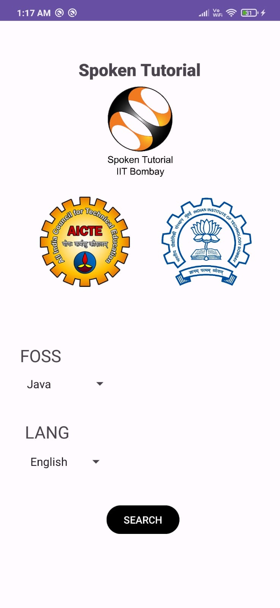
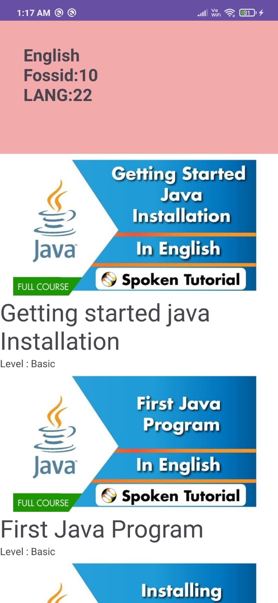

# Spoken Tutorial Course Finder

Spoken Tutorial Courses is an Android application that helps users search for courses on specific programming languages available in various regional languages. This application is developed using Kotlin, with the help of the Volley library and YouTube API.

## Features
- Search for programming language courses.
- Filter courses by regional languages.
- View course details and related YouTube videos.
- Easy-to-use interface with seamless navigation.


## Screenshots

<p align="center">
  
  
  
</p>

## Installation

To get a local copy up and running, follow these steps:

1. Clone the repository:
   ```bash
   git clone https://github.com/PIYUSH-69/SpokenTutorial_Application.git
2.Open the project in Android Studio.
3.Build and run the project on your Android device or emulator.

## Reference
This project was developed using the course from Swayam as a reference.

Course link : https://onlinecourses.swayam2.ac.in/aic20_sp02/course

## Libraries Used


Volley - For network requests.
YouTube API - For fetching and displaying YouTube videos.

   
